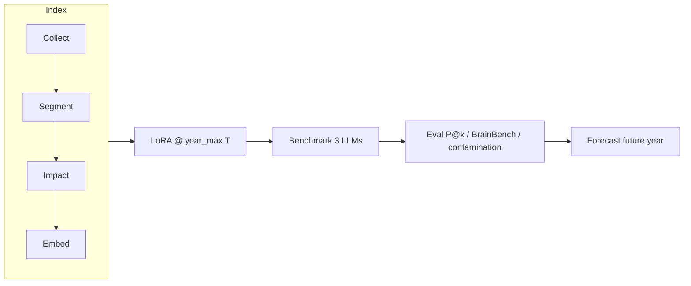

# Neurolink Protocol

This document describes the full experimental protocol: index construction, LoRA training, comparative benchmark, and forecasting. Reference hyperparameters are in `[config/protocol.yaml](config/protocol.yaml)`.

## Overview




**Complete workflow** (`neurolink workflow`):

1. **Index** — PubMed corpus → extracted, scored, and vectorized questions
2. **LoRA @ 2022** — temporal fine-tuning through anchor 2022
3. **Benchmark + eval** — compare the 3 LLMs on years > 2022
4. **LoRA @ 2025** — re-training with extended corpus
5. **Benchmark + eval** — compare on years > 2025
6. **Forecast 2027** — prediction without ground truth (LoRA frozen at 2025, partial 2026 context)


## Index

`config/index/pipeline.yaml`


| Stage       | Role                                                                                                 | Config                      |
| ----------- | ---------------------------------------------------------------------------------------------------- | --------------------------- |
| **Collect** | Fetch PubMed abstracts (`cortex neuroscience` term, 2000–2026, excluding reviews)                    | `config/index/collect.yaml` |
| **Segment** | Split abstracts into sentences; PubMedBERT assigns each sentence to *question* or *results*          | `config/index/segment.yaml` |
| **Impact**  | OpenAlex citations → normalized score (citations/year); marks *critical* questions (90th percentile) | `config/index/impact.yaml`  |
| **Embed**   | Semantic embeddings (MiniLM-L6-v2, TF-IDF fallback)                                                  | `config/index/embed.yaml`   |


Output: SQLite database `data/neurolink.db` with dated, scored, and vectorized questions.

## LoRA Training

The **literature_lora** model starts from `mistralai/Mistral-7B-v0.1` and receives a LoRA adapter (r=16, α=32, 4-bit).

### Temporal principle

For each year `T` where `T+1 ≤ year_max`:

- **Prompt**: context of questions published through `T` (top impact, 5-year window)
- **Target**: one question actually published in `T+1`

The training prompt format is **identical** to inference, aligning learning and forecasting.

### Training hyperparameters


| Parameter            | Value                             |
| -------------------- | --------------------------------- |
| `train_epochs`       | 1                                 |
| `train_lr`           | 1e-4                              |
| `train_fraction`     | 0.7 (70% of questions per year)   |
| `error_train_epochs` | 2 (correction on semantic errors) |
| `semantic_threshold` | 0.55 (TF-IDF cosine)              |
| `training_prompt_k`  | 1                                 |


The adapter is saved under `data/models/literature/year_max_{T}/lora/` and **frozen** at the chosen anchor for benchmarking.

## Benchmark

`config/forecast/predict_compare.yaml`.

Three models share the **same generation prompt** (impact-ranked context, novelty constraints, numbered format):


| Model             | Role in benchmark                                  |
| ----------------- | -------------------------------------------------- |
| `literature_lora` | Mistral-7B + LoRA adapter frozen at `year_max = T` |
| `mistral_base`    | Mistral-7B-v0.1 without adapter                    |
| `braingpt`        | BrainGPT-7B-v0.2 (neuroscience-specialized LLM)    |


### Evaluation years

For a LoRA anchor `year_max = T`, all years **> T** with questions in the database are evaluated.

Examples:


| LoRA anchor | Benchmark years  |
| ----------- | ---------------- |
| 2022        | 2023, 2024, 2025 |
| 2025        | 2026             |


At inference for year `N`, context includes literature through `N−1` (simulating a real forecast).

### LLM inference


| Parameter               | Value               |
| ----------------------- | ------------------- |
| `max_context_questions` | 40                  |
| `max_new_tokens`        | 96                  |
| `temperature`           | 0.0 (deterministic) |
| `top_p`                 | 1.0                 |
| `seed`                  | 42                  |


## Evaluation

Scenario configs: `config/eval/scenarios/eval_compare_2022.yaml`, `eval_compare_2025.yaml`.

### Forecast metrics


| Metric                     | Description                                                                | Config                                        |
| -------------------------- | -------------------------------------------------------------------------- | --------------------------------------------- |
| **Precision@k / Recall@k** | Semantic similarity (TF-IDF cosine) between predictions and real questions | `top_k: [10, 50]`, `semantic_threshold: 0.55` |
| **BrainBench**             | Paired perplexity discrimination (real passage vs. distractor)             | `brainbench_max_pairs: 50`                    |
| **Contamination**          | LoRA memorization audit (zlib/perplexity ratio, corpus recycling)          | `contamination_corpus_sample: 200`            |


BrainBench and contamination follow the framework of [Luo et al., 2025](https://www.nature.com/articles/s41562-024-02046-9).

### Emergence scoring (index)

Weights for ranking emergent directions (`config/protocol.yaml`):


| Component      | Weight |
| -------------- | ------ |
| Growth         | 0.35   |
| Novelty        | 0.25   |
| Atypicality    | 0.25   |
| Semantic shift | 0.15   |


## Prospective forecast

2027 scenario: `config/forecast/scenarios/predict_2027.yaml`.

- LoRA frozen at `year_max = 2025`
- Context includes partial 2026 literature
- **No ground truth** — predictive output only, no eval


## Config files


| File                                          | Usage                                                               |
| --------------------------------------------- | ------------------------------------------------------------------- |
| `config/protocol.yaml`                        | Reference hyperparameters (manual mirror, not loaded automatically) |
| `config/forecast/predict_compare.yaml`        | 3-LLM benchmark                                                     |
| `config/forecast/predict_literature.yaml`     | LoRA-only training and forecast                                     |
| `config/forecast/scenarios/predict_2027.yaml` | Prospective forecast                                                |
| `config/eval/scenarios/eval_compare_*.yaml`   | Post-benchmark eval                                                 |


## Commands

```bash
neurolink index                              # full index pipeline
neurolink train-literature --year-max 2022   # LoRA through 2022
neurolink compare --lora-year-max 2022       # 3-LLM benchmark
neurolink eval --config config/eval/scenarios/eval_compare_2022.yaml
neurolink workflow                           # complete protocol
neurolink workflow --skip-index              # if index already built
```

