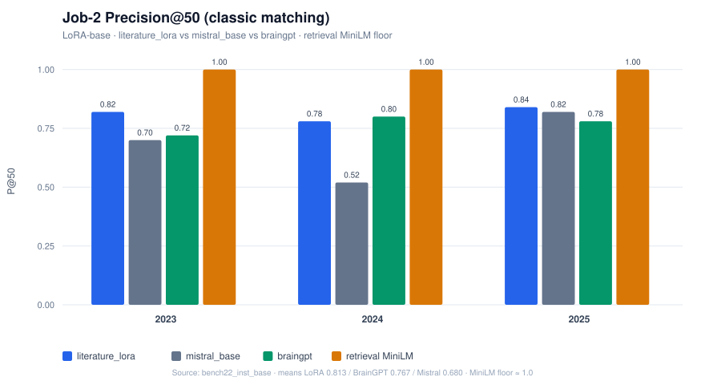
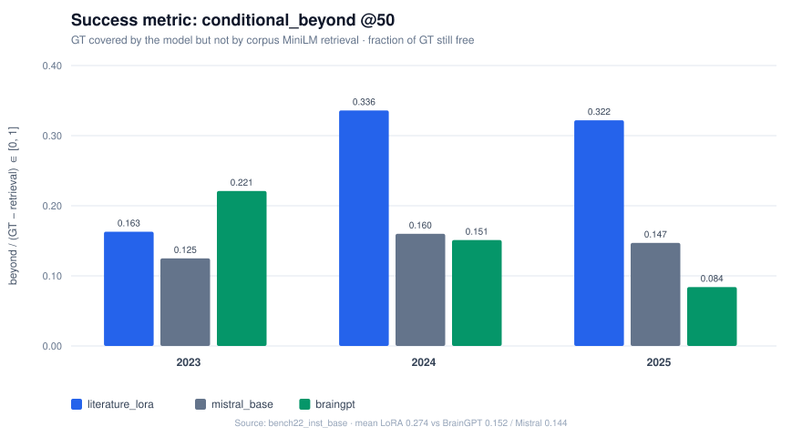

# Neurolink

Modular pipeline to forecast emergent neuroscience research directions from PubMed literature.

**Literature LoRA**: fine-tune Mistral-7B on temporal direction pairs, with benchmark against Mistral-7B base and BrainGPT.


## Why these models?

Neurolink compares three 7B-scale causal LMs on the same forecast task: propose novel neuroscience **research directions** for a target year, given impact-ranked context from prior years. The trio isolates three hypotheses:


| Model             | Hypothesis tested                                                                          |
| ----------------- | ------------------------------------------------------------------------------------------ |
| `mistral_base`    | A general-purpose LLM already captures temporal research trends without domain fine-tuning |
| `literature_lora` | Temporal LoRA on indexed direction pairs teaches the model to forecast what comes next     |
| `braingpt`        | A neuroscience-specialized pre-training (BrainGPT) outperforms raw Mistral                 |


### Capabilities

All three models share the same **Year N → Year N+1** continuation protocol and the same inference budget (iterative generation, soft truncate ≈25 words, near-dedup MiniLM). Instruct LoRA is a parallel experiment with a batch prompt; baselines stay on continuation prompts.

- **Mistral-7B-v0.1** (`mistral_base`): open general-purpose baseline; no adapter.
- **Literature LoRA** (`literature_lora`): Mistral-7B + LoRA (`r=16`, q/v) trained on temporal pairs (context ≤ year *T* → directions at *T+1*). Adapter frozen at anchor `year_max`.
- **BrainGPT-7B-v0.2** (`braingpt`): neuroscience-specialized LM ([BrainGPT](https://huggingface.co/BrainGPT/BrainGPT-7B-v0.2)).

**Inference:** up to **30** high-impact context directions; sampling `temperature=0.7`, `top_p=0.9`, pool ≈3×k then filter / MiniLM near-dedup / rerank to top-k. GPU + 4-bit quantization for train and benchmark.

## Benchmark results (`year_max=2022` → 2023–2025)

Continuity with past literature is **expected**. Absolute P@k is therefore incomplete: a non-generative **corpus MiniLM retrieval** already reaches P@50 ≈ 1.0. The success metric is **how many ground-truth directions the model covers that retrieval misses**.

### Classic matching (P@50)

| Model (mean 2023–2025) | P@10      | P@50      | R@50      | ext_vs_context |
| ---------------------- | --------- | --------- | --------- | -------------- |
| **literature_lora**    | 0.767     | **0.813** | **0.399** | **+0.467**     |
| mistral_base           | 0.800     | 0.680     | 0.258     | +0.020         |
| braingpt               | **0.967** | 0.767     | 0.274     | +0.053         |



LoRA leads generative models on P@50 / R@50 and recycles the **prompt** much less (`extension_vs_context`). BrainGPT wins P@10 (title-like top hits). Absolute P@50 sits below the non-generative MiniLM retrieval floor (~1.0).

### Beyond retrieval (speaking success scale)

`conditional_beyond` = GT hits unique to the model / GT still free after retrieval ∈ [0, 1].

| Model               | mean `conditional_beyond`   | mean `incremental_recall` |
| ------------------- | --------------------------- | ------------------------- |
| **literature_lora** | **0.274** (~27% of free GT) | **0.156**                 |
| braingpt            | 0.152                       | 0.083                     |
| mistral_base        | 0.144                       | 0.081                     |



**Takeaway:** among generative models, LoRA roughly **doubles** the incremental GT coverage beyond retrieval, while remaining strongly corpus-like (continuity of the corpus, not pure invention).

## Installation

```bash
python -m venv .venv
source .venv/bin/activate
pip install -e .
pip install -e ".[train,ml]"   # LoRA + 4-bit + MiniLM (GPU)
```

Set `HF_TOKEN` for gated models (Mistral-7B, BrainGPT).

## Quick start

### Interactive menu (cluster jobs)

```bash
neurolink menu
# or: neurolink jobs / neurolink submit <job> [--account …] [--time …] [--dry-run]
```

On Cluster:

```bash
bash scripts/cluster/setup_login.sh
bash scripts/cluster/login_index.sh
sbatch scripts/cluster/job1_direction_embed.slurm
sbatch scripts/cluster/job_train_lora_base.slurm
sbatch scripts/cluster/job_train_lora_instruct.slurm   # optional
sbatch scripts/cluster/job_benchmark_2022.slurm
```

## Reference

Pipeline config inspired by [MMORE RAG Pipeline](https://arxiv.org/html/2509.11937v1) (Light Laboratory, Swiss-AI @EPFL).

Motivated by [Large language models surpass human experts in predicting neuroscience results](https://www.nature.com/articles/s41562-024-02046-9).