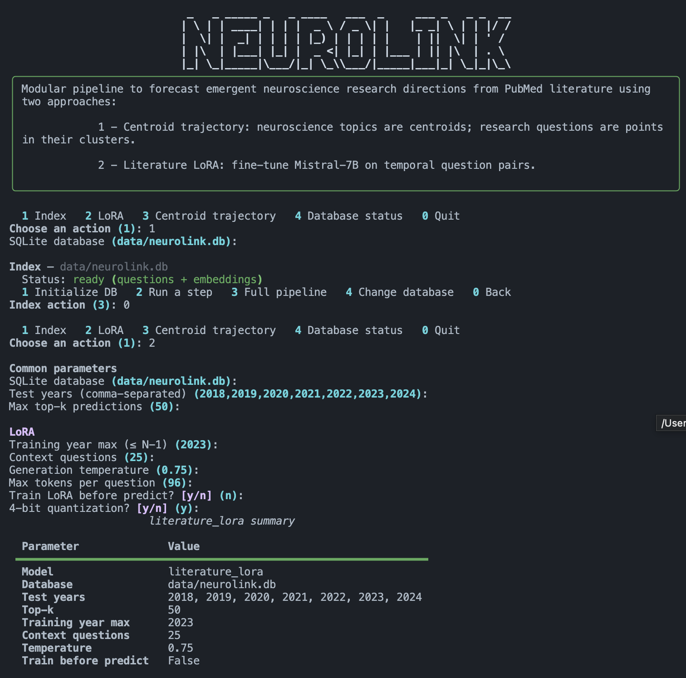

# Neurolink

Modular pipeline to forecast emergent neuroscience research directions from PubMed literature using two approaches:

**1 - Centroid trajectory**: neuroscience topics are centroids; research questions are points in their clusters.

**2 - Literature LoRA**: fine-tune Mistral-7B on temporal question pairs.


## Installation

**Venv**

```bash
cd neurolink
python -m venv .venv
source .venv/bin/activate
```

**Dependencies**

```bash
pip install -e .
# optional: Centroid trajectory
# pip install -e ".[ml]"
# optional: LoRA training
# pip install -e ".[train]"
```

**CLI**

```bash
python -m neurolink menu
```



**Two approaches**

**Literature LoRA approach** (`literature_lora`)

- `train_literature` : fine-tune LoRA on pairs context ≤ T → questions at T+1.
- `predict` : prompt with top questions ≤ N−1 → generate novel questions for N.
- Code: `forecast/predict/literature_lora.py`, `forecast/train.py`.

**Centroid approach** (`centroid_trajectory`)

- `topics` : multi-year trajectories per theme track.
- `predict` : LLM generates questions from trajectory signals.
- Code: `forecast/predict/centroid_trajectory.py`, `forecast/topics.py`.

**Literature LoRA — train vs predict**

The LoRA adapter is saved locally under `data/models/literature/year_max_*/lora/`.
Inference can run **without retraining**:

```bash
# Train once
neurolink train-literature --year-max 2023 --config config/forecast/predict_literature.yaml

# Infer only (no train_literature stage)
neurolink literature --config config/forecast/pipeline_literature.yaml
```

Train and predict in one command: `config/forecast/pipeline_literature_train.yaml`.

## Evaluation

TF-IDF semantic matching between generated predictions and ground-truth questions for year N.

Metrics: precision@k, recall@k.

## Reference

Pipeline config files inspired by
[MMORE RAG Pipeline](https://arxiv.org/html/2509.11937v1) (Light Laboratory, Swiss-AI @EPFL).

Motivated by [Forecasting emerging research directions](https://www.nature.com/articles/s41562-024-02046-9).
